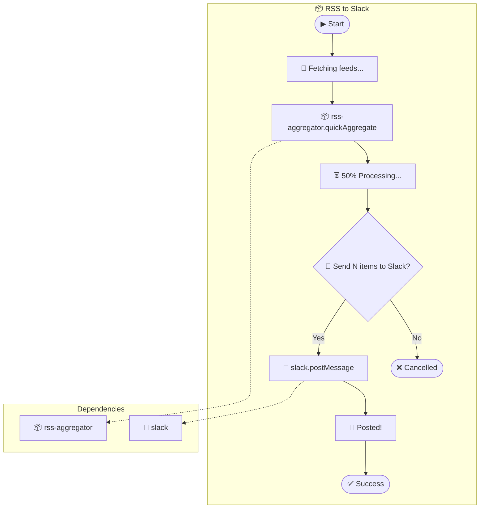
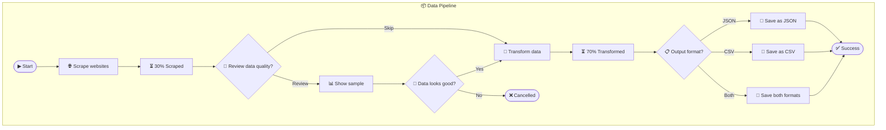
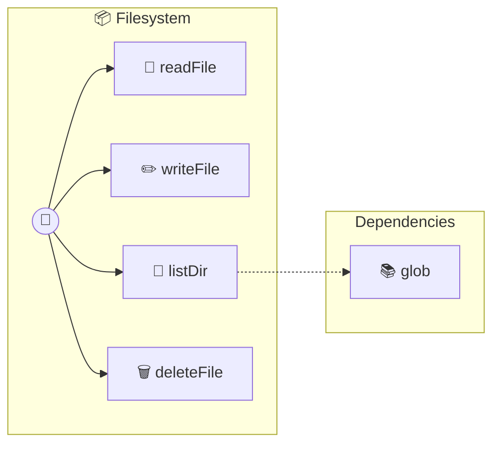
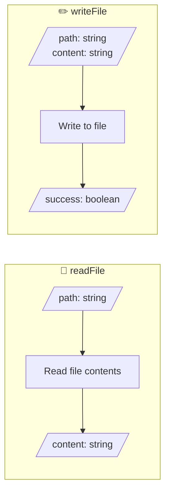
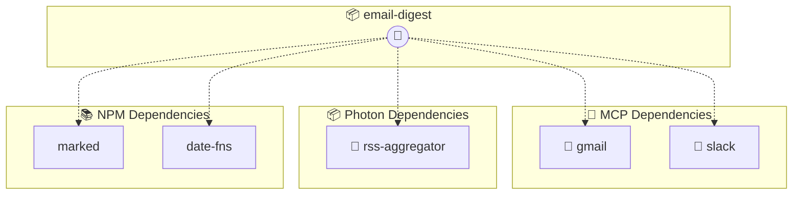

# Photon Visualizer

## Overview

Generate **Mermaid diagrams** for any Photon type:

- **Workflow Photons** (generators with ask/emit) → Flowcharts showing execution flow
- **Tool Collection Photons** (async methods) → API surface diagrams

This enables:

- **Visual documentation** of Photon workflows
- **Design-first workflows** - sketch in Mermaid, generate Photon
- **PR reviews** - see workflow logic visually in GitHub
- **Refinement** - edit either representation, sync the other

---

## Core Concepts

### The Photon↔Mermaid Mapping

```
┌─────────────────────────────────────────────────────────────────┐
│                    BIDIRECTIONAL SYNC                           │
│                                                                 │
│   ┌──────────────┐            ┌──────────────┐                 │
│   │   Photon     │  ◄──────►  │   Mermaid    │                 │
│   │   (.ts)      │            │   Diagram    │                 │
│   │              │            │              │                 │
│   │ Executable   │            │ Visual in    │                 │
│   │ Schedulable  │            │ GitHub/VSCode│                 │
│   │ Testable     │            │ Notion/Docs  │                 │
│   └──────────────┘            └──────────────┘                 │
└─────────────────────────────────────────────────────────────────┘
```

### Visual Conventions

| Photon Element | Mermaid Shape | Example |
|----------------|---------------|---------|
| Start/End | Stadium `([...])` | `([▶ Start])` |
| `emit: status` | Rectangle `[...]` | `[📢 Connecting...]` |
| `emit: progress` | Rectangle with % | `[⏳ 50% Processing]` |
| `ask: confirm` | Diamond `{...}` | `{🙋 Continue?}` |
| `ask: select` | Diamond | `{📋 Choose format}` |
| `ask: text` | Diamond | `{✏️ Enter name}` |
| MCP call | Rectangle with icon | `[📧 gmail.send]` |
| Photon call | Rectangle with icon | `[📦 rss-aggregator]` |
| Conditional | Arrow labels | `-->│Yes│` `-->│No│` |
| Dependencies | Dotted arrow `-.->` | `STEP -.-> DEP` |

---

## Process

### Photon → Mermaid (Visualization)

#### Step 1: Identify the Flow Structure

Parse the Photon's generator method to extract:
1. **Emits** - Status updates, progress, logs
2. **Asks** - Decision points requiring user input
3. **MCP calls** - External service interactions
4. **Photon calls** - Nested workflow invocations
5. **Conditionals** - if/else branches
6. **Return points** - Success/failure endpoints

#### Step 2: Map to Mermaid Nodes

```typescript
// Photon code:
yield { emit: 'status', message: 'Starting...' };

// Mermaid node:
STATUS1[📢 Starting...]
```

```typescript
// Photon code:
const proceed: boolean = yield { ask: 'confirm', message: 'Continue?' };
if (!proceed) return { cancelled: true };

// Mermaid nodes:
CONFIRM{🙋 Continue?}
CONFIRM -->|No| CANCELLED([❌ Cancelled])
CONFIRM -->|Yes| NEXT_STEP
```

#### Step 3: Generate the Diagram

Use this template:


---

### Mermaid → Photon (Code Generation)

#### Step 1: Parse the Mermaid Diagram

Extract from the flowchart:
1. **Nodes** - Each step in the workflow
2. **Edges** - Flow connections and conditions
3. **Subgraphs** - Dependencies and groupings
4. **Labels** - Action descriptions and conditions

#### Step 2: Identify Node Types

| Mermaid Pattern | Photon Element |
|-----------------|----------------|
| `([...])` stadium | Start/End/Return |
| `[📢 ...]` status emoji | `yield { emit: 'status' }` |
| `[⏳ X% ...]` progress | `yield { emit: 'progress' }` |
| `{🙋 ...}` confirm emoji | `yield { ask: 'confirm' }` |
| `{📋 ...}` select emoji | `yield { ask: 'select' }` |
| `{✏️ ...}` text emoji | `yield { ask: 'text' }` |
| `[📧 mcp.action]` | `await this.mcp('name').action()` |
| `[📦 photon-name]` | `yield* this.photon('name').run()` |
| `-.->` dotted | Dependency declaration |

#### Step 3: Generate Photon Skeleton

```typescript
/**
 * [Workflow Name]
 *
 * @name workflow-name
 * @description [Generated from Mermaid diagram]
 *
 * @dependencies [extracted from subgraph]
 * @mcps [extracted from dotted arrows to 🔌 nodes]
 * @photons [extracted from dotted arrows to 📦 nodes]
 */

export default class WorkflowName {
  async *run(params: { /* extracted from inputs */ }) {
    // Generated from Mermaid nodes...
  }
}
```

---

## Examples

### Example 1: Simple RSS to Slack Workflow

#### Photon Code

```typescript
/**
 * @name rss-to-slack
 * @mcps slack
 * @photons rss-aggregator
 */
export default class RssToSlack {
  async *run(params: { feeds: string[]; channel: string }) {
    yield { emit: 'status', message: 'Fetching feeds...' };

    const rss = yield* this.photon('rss-aggregator').quickAggregate({
      feeds: params.feeds,
      format: 'json'
    });

    yield { emit: 'progress', value: 0.5, message: 'Processing...' };

    const send: boolean = yield {
      ask: 'confirm',
      message: `Send ${rss.entriesCollected} items to Slack?`
    };

    if (!send) return { cancelled: true };

    await this.mcp('slack').postMessage({
      channel: params.channel,
      text: this.formatDigest(rss.entries)
    });

    yield { emit: 'toast', message: 'Posted!', type: 'success' };
    return { success: true, count: rss.entriesCollected };
  }
}
```

#### Mermaid Diagram



---

### Example 2: Multi-Step Data Pipeline

#### Mermaid Diagram (Design First)



#### Generated Photon

```typescript
/**
 * @name data-pipeline
 * @description Multi-step data pipeline with quality review
 */
export default class DataPipeline {
  async *run(params: { urls: string[] }) {
    yield { emit: 'status', message: 'Scraping websites...' };
    const scraped = await this.scrape(params.urls);
    yield { emit: 'progress', value: 0.3, message: 'Scraped' };

    const review: boolean = yield {
      ask: 'confirm',
      message: 'Review data quality?',
      default: false
    };

    if (review) {
      yield { emit: 'artifact', type: 'json', content: JSON.stringify(scraped.slice(0, 5)) };

      const approved: boolean = yield {
        ask: 'confirm',
        message: 'Data looks good?'
      };

      if (!approved) return { cancelled: true };
    }

    yield { emit: 'status', message: 'Transforming data...' };
    const transformed = this.transform(scraped);
    yield { emit: 'progress', value: 0.7, message: 'Transformed' };

    const format: string = yield {
      ask: 'select',
      message: 'Output format?',
      options: ['JSON', 'CSV', 'Both']
    };

    await this.save(transformed, format.toLowerCase());

    return { success: true, count: transformed.length };
  }
}
```

---

## Reference Files

Load these resources as needed:

- [📐 Mermaid Syntax Reference](./reference/mermaid-syntax.md) - Flowchart shapes, arrows, subgraphs
- [🔄 Photon Patterns](./reference/photon-patterns.md) - Common Photon patterns and their Mermaid equivalents
- [📚 Example Library](./reference/examples.md) - Complete example conversions

---

## Visualizing Non-Workflow Photons

Not all Photons are workflow generators with ask/emit patterns. Many are simple **tool collections** - async methods that provide focused capabilities. These can also be visualized!

### Diagram Types for Regular Photons

#### 1. API Surface Diagram

Shows all available tools as a visual "menu" - great for documentation.

**Example Photon:**
```typescript
/**
 * @name filesystem
 * @description File system operations
 * @dependencies glob@^8.0.0
 */
export default class Filesystem {
  async readFile(params: { path: string }) { /* ... */ }
  async writeFile(params: { path: string; content: string }) { /* ... */ }
  async listDir(params: { path: string; recursive?: boolean }) { /* ... */ }
  async deleteFile(params: { path: string }) { /* ... */ }
}
```

**Mermaid Diagram:**


#### 2. Tool Parameter Diagram

Shows input→action→output for each tool - useful for understanding data flow.

**Mermaid:**


#### 3. Dependency Graph

Shows the full dependency tree - MCPs, Photons, npm packages.

**Mermaid:**


### Auto-Generation Rules

When analyzing a Photon for auto-diagram generation:

#### Step 1: Detect Photon Type

| Pattern | Type | Diagram Style |
|---------|------|---------------|
| `async *methodName()` | Generator/Workflow | Flowchart with ask/emit nodes |
| `async methodName()` | Regular Tool | API surface + params diagram |

#### Step 2: Extract Information

For **any** Photon, extract:
1. **Metadata** - From JSDoc: `@name`, `@description`, `@dependencies`, `@mcps`, `@photons`
2. **Tools** - All public async methods
3. **Parameters** - Method parameters with types
4. **Return types** - What each tool returns

For **workflow** Photons, also extract:
5. **Yields** - All `yield { emit: ... }` and `yield { ask: ... }`
6. **Conditionals** - Branch points based on ask responses
7. **MCP calls** - `this.mcp('name').method()`
8. **Photon calls** - `yield* this.photon('name').method()`

#### Step 3: Generate Appropriate Diagram

```typescript
function selectDiagramType(photon: PhotonMetadata): DiagramType {
  const hasGenerators = photon.tools.some(t => t.isGenerator);
  const hasAskEmit = photon.tools.some(t => t.hasYieldStatements);

  if (hasGenerators && hasAskEmit) {
    return 'workflow-flowchart';  // Full ask/emit flow
  } else if (hasGenerators) {
    return 'streaming-flowchart'; // Generator without user interaction
  } else {
    return 'api-surface';         // Simple tool collection
  }
}
```

### Template for Auto-Generated Documentation

When the Photon runtime generates markdown docs, include the diagram:

```markdown
# Photon Name

Description here.

## 📊 Visual Overview

<!-- AUTO-GENERATED DIAGRAM -->
\`\`\`mermaid
flowchart TD
    ...
\`\`\`

## ⚙️ Configuration
...

## 🔧 Tools
...
```

### Emoji Legend for Tool Types

Use these emojis consistently based on the tool's primary action:

| Action Type | Emoji | Example |
|-------------|-------|---------|
| Read/Get | 📖 | `readFile`, `getUser`, `fetchData` |
| Write/Create | ✏️ | `writeFile`, `createRecord` |
| List/Search | 📂 | `listDir`, `search`, `find` |
| Delete/Remove | 🗑️ | `deleteFile`, `removeItem` |
| Send/Post | 📤 | `sendEmail`, `postMessage` |
| Transform | 🔄 | `convert`, `transform`, `format` |
| Validate | ✅ | `validate`, `check`, `verify` |
| Configure | ⚙️ | `configure`, `setOptions` |
| Execute | ▶️ | `run`, `execute`, `start` |
| Stop | ⏹️ | `stop`, `cancel`, `abort` |

---

## Tips for AI

### When Converting Photon → Mermaid

1. **Start with the generator method** - The `async *run()` or similar method defines the flow
2. **Track variable assignments** - Variables from `yield { ask }` create branches
3. **Follow conditional logic** - `if` statements create diamond decision nodes
4. **Identify external calls** - MCP and Photon calls get special icons
5. **Extract dependencies** - Look at `@mcps` and `@photons` in JSDoc

### When Converting Mermaid → Photon

1. **Parse node types by shape** - Stadiums are endpoints, diamonds are decisions
2. **Parse node types by emoji** - 📢 status, 🙋 confirm, 📋 select, ✏️ text
3. **Follow arrow labels** - `|Yes|` and `|No|` indicate conditional branches
4. **Extract dependencies** - Dotted arrows point to required MCPs/Photons
5. **Generate TypeScript** - Use proper async generator syntax

### Validation

After conversion, verify:
- All nodes from Mermaid appear in Photon (and vice versa)
- Decision branches match conditional logic
- Dependencies are properly declared
- The generated code is syntactically valid

---

## Photon Runtime Integration

The Photon runtime can integrate diagram generation into its documentation pipeline.

### Integration Point: PhotonDocExtractor

The `PhotonDocExtractor` class already extracts:
- Tool methods (name, params, description)
- Dependencies (@dependencies, @mcps, @photons)
- Method types (async vs async generator)

**Enhancement: Add diagram generation**

```typescript
// In photon-doc-extractor.ts
export class PhotonDocExtractor {
  // ... existing methods ...

  /**
   * Generate Mermaid diagram for this Photon
   */
  async generateDiagram(): Promise<string> {
    const tools = await this.extractTools();
    const deps = this.extractDependencies();
    const photonType = this.detectPhotonType(tools);

    switch (photonType) {
      case 'workflow':
        return this.generateWorkflowDiagram(tools);
      case 'streaming':
        return this.generateStreamingDiagram(tools);
      default:
        return this.generateApiSurfaceDiagram(tools, deps);
    }
  }

  private detectPhotonType(tools: Tool[]): 'workflow' | 'streaming' | 'api' {
    const hasGenerator = tools.some(t => t.isGenerator);
    const hasAskEmit = this.hasAskEmitPatterns();

    if (hasGenerator && hasAskEmit) return 'workflow';
    if (hasGenerator) return 'streaming';
    return 'api';
  }

  private hasAskEmitPatterns(): boolean {
    return /yield\s*\{\s*(ask|emit)\s*:/.test(this.content);
  }
}
```

### Integration Point: TemplateManager

Update `photon.md` template to include diagram:

```typescript
// In template-manager.ts getDefaultPhotonTemplate()
private getDefaultPhotonTemplate(): string {
  return `# \${properName(description, name)}

\${cleanDesc(description)}

## 📊 Visual Overview

\${$if(diagram, \`
\\\`\\\`\\\`mermaid
\${diagram}
\\\`\\\`\\\`
\`, '')}

## 📋 Overview
...`;
}
```

### CLI Integration

```bash
# Generate docs with diagrams
photon maker sync --with-diagrams

# Generate diagram for single photon
photon diagram ./my-workflow.photon.ts

# Output formats
photon diagram ./my-workflow.photon.ts --format mermaid  # default
photon diagram ./my-workflow.photon.ts --format svg      # rendered
photon diagram ./my-workflow.photon.ts --format png      # image
```

### Benefits of Auto-Generated Diagrams

1. **Always in sync** - Diagrams update when code changes
2. **Zero effort** - No manual diagram maintenance
3. **Visual PR reviews** - See workflow changes at a glance
4. **Better onboarding** - New team members understand flows quickly
5. **Documentation quality** - Every Photon has visual docs
