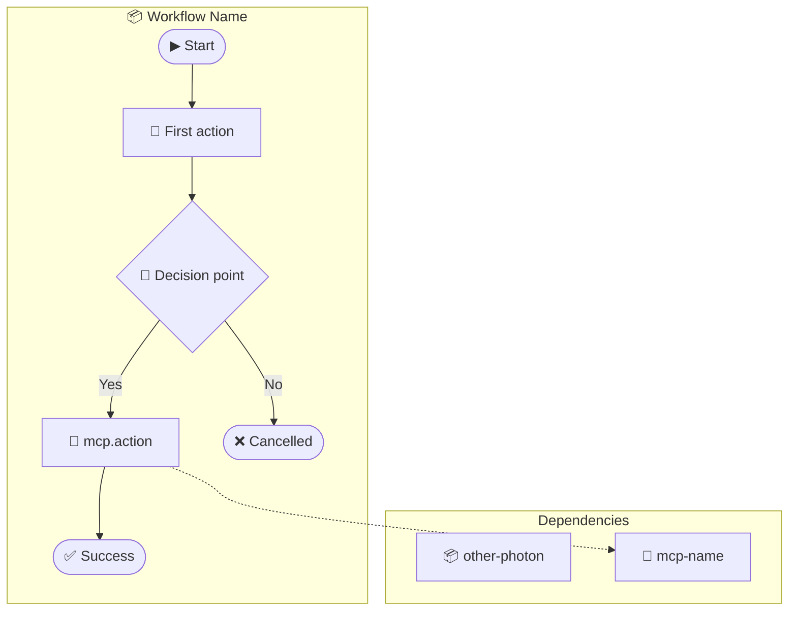

# Photon Visualizer

## Overview

Convert between **Photon code** (executable TypeScript workflows) and **Mermaid diagrams** (visual flowcharts). This enables:

- **Visual documentation** of Photon workflows
- **Design-first workflows** - sketch in Mermaid, generate Photon
- **PR reviews** - see workflow logic visually in GitHub
- **Refinement** - edit either representation, sync the other

---

## Core Concepts

### The Photon↔Mermaid Mapping

```
┌─────────────────────────────────────────────────────────────────┐
│                    BIDIRECTIONAL SYNC                           │
│                                                                 │
│   ┌──────────────┐            ┌──────────────┐                 │
│   │   Photon     │  ◄──────►  │   Mermaid    │                 │
│   │   (.ts)      │            │   Diagram    │                 │
│   │              │            │              │                 │
│   │ Executable   │            │ Visual in    │                 │
│   │ Schedulable  │            │ GitHub/VSCode│                 │
│   │ Testable     │            │ Notion/Docs  │                 │
│   └──────────────┘            └──────────────┘                 │
└─────────────────────────────────────────────────────────────────┘
```

### Visual Conventions

| Photon Element | Mermaid Shape | Example |
|----------------|---------------|---------|
| Start/End | Stadium `([...])` | `([▶ Start])` |
| `emit: status` | Rectangle `[...]` | `[📢 Connecting...]` |
| `emit: progress` | Rectangle with % | `[⏳ 50% Processing]` |
| `ask: confirm` | Diamond `{...}` | `{🙋 Continue?}` |
| `ask: select` | Diamond | `{📋 Choose format}` |
| `ask: text` | Diamond | `{✏️ Enter name}` |
| MCP call | Rectangle with icon | `[📧 gmail.send]` |
| Photon call | Rectangle with icon | `[📦 rss-aggregator]` |
| Conditional | Arrow labels | `-->│Yes│` `-->│No│` |
| Dependencies | Dotted arrow `-.->` | `STEP -.-> DEP` |

---

## Process

### Photon → Mermaid (Visualization)

#### Step 1: Identify the Flow Structure

Parse the Photon's generator method to extract:
1. **Emits** - Status updates, progress, logs
2. **Asks** - Decision points requiring user input
3. **MCP calls** - External service interactions
4. **Photon calls** - Nested workflow invocations
5. **Conditionals** - if/else branches
6. **Return points** - Success/failure endpoints

#### Step 2: Map to Mermaid Nodes

```typescript
// Photon code:
yield { emit: 'status', message: 'Starting...' };

// Mermaid node:
STATUS1[📢 Starting...]
```

```typescript
// Photon code:
const proceed: boolean = yield { ask: 'confirm', message: 'Continue?' };
if (!proceed) return { cancelled: true };

// Mermaid nodes:
CONFIRM{🙋 Continue?}
CONFIRM -->|No| CANCELLED([❌ Cancelled])
CONFIRM -->|Yes| NEXT_STEP
```

#### Step 3: Generate the Diagram

Use this template:



---

### Mermaid → Photon (Code Generation)

#### Step 1: Parse the Mermaid Diagram

Extract from the flowchart:
1. **Nodes** - Each step in the workflow
2. **Edges** - Flow connections and conditions
3. **Subgraphs** - Dependencies and groupings
4. **Labels** - Action descriptions and conditions

#### Step 2: Identify Node Types

| Mermaid Pattern | Photon Element |
|-----------------|----------------|
| `([...])` stadium | Start/End/Return |
| `[📢 ...]` status emoji | `yield { emit: 'status' }` |
| `[⏳ X% ...]` progress | `yield { emit: 'progress' }` |
| `{🙋 ...}` confirm emoji | `yield { ask: 'confirm' }` |
| `{📋 ...}` select emoji | `yield { ask: 'select' }` |
| `{✏️ ...}` text emoji | `yield { ask: 'text' }` |
| `[📧 mcp.action]` | `await this.mcp('name').action()` |
| `[📦 photon-name]` | `yield* this.photon('name').run()` |
| `-.->` dotted | Dependency declaration |

#### Step 3: Generate Photon Skeleton

```typescript
/**
 * [Workflow Name]
 *
 * @name workflow-name
 * @description [Generated from Mermaid diagram]
 *
 * @dependencies [extracted from subgraph]
 * @mcps [extracted from dotted arrows to 🔌 nodes]
 * @photons [extracted from dotted arrows to 📦 nodes]
 */

export default class WorkflowName {
  async *run(params: { /* extracted from inputs */ }) {
    // Generated from Mermaid nodes...
  }
}
```

---

## Examples

### Example 1: Simple RSS to Slack Workflow

#### Photon Code

```typescript
/**
 * @name rss-to-slack
 * @mcps slack
 * @photons rss-aggregator
 */
export default class RssToSlack {
  async *run(params: { feeds: string[]; channel: string }) {
    yield { emit: 'status', message: 'Fetching feeds...' };

    const rss = yield* this.photon('rss-aggregator').quickAggregate({
      feeds: params.feeds,
      format: 'json'
    });

    yield { emit: 'progress', value: 0.5, message: 'Processing...' };

    const send: boolean = yield {
      ask: 'confirm',
      message: `Send ${rss.entriesCollected} items to Slack?`
    };

    if (!send) return { cancelled: true };

    await this.mcp('slack').postMessage({
      channel: params.channel,
      text: this.formatDigest(rss.entries)
    });

    yield { emit: 'toast', message: 'Posted!', type: 'success' };
    return { success: true, count: rss.entriesCollected };
  }
}
```

#### Mermaid Diagram


---

### Example 2: Multi-Step Data Pipeline

#### Mermaid Diagram (Design First)


#### Generated Photon

```typescript
/**
 * @name data-pipeline
 * @description Multi-step data pipeline with quality review
 */
export default class DataPipeline {
  async *run(params: { urls: string[] }) {
    yield { emit: 'status', message: 'Scraping websites...' };
    const scraped = await this.scrape(params.urls);
    yield { emit: 'progress', value: 0.3, message: 'Scraped' };

    const review: boolean = yield {
      ask: 'confirm',
      message: 'Review data quality?',
      default: false
    };

    if (review) {
      yield { emit: 'artifact', type: 'json', content: JSON.stringify(scraped.slice(0, 5)) };

      const approved: boolean = yield {
        ask: 'confirm',
        message: 'Data looks good?'
      };

      if (!approved) return { cancelled: true };
    }

    yield { emit: 'status', message: 'Transforming data...' };
    const transformed = this.transform(scraped);
    yield { emit: 'progress', value: 0.7, message: 'Transformed' };

    const format: string = yield {
      ask: 'select',
      message: 'Output format?',
      options: ['JSON', 'CSV', 'Both']
    };

    await this.save(transformed, format.toLowerCase());

    return { success: true, count: transformed.length };
  }
}
```

---

## Reference Files

Load these resources as needed:

- [📐 Mermaid Syntax Reference](./reference/mermaid-syntax.md) - Flowchart shapes, arrows, subgraphs
- [🔄 Photon Patterns](./reference/photon-patterns.md) - Common Photon patterns and their Mermaid equivalents
- [📚 Example Library](./reference/examples.md) - Complete example conversions

---

## Tips for AI

### When Converting Photon → Mermaid

1. **Start with the generator method** - The `async *run()` or similar method defines the flow
2. **Track variable assignments** - Variables from `yield { ask }` create branches
3. **Follow conditional logic** - `if` statements create diamond decision nodes
4. **Identify external calls** - MCP and Photon calls get special icons
5. **Extract dependencies** - Look at `@mcps` and `@photons` in JSDoc

### When Converting Mermaid → Photon

1. **Parse node types by shape** - Stadiums are endpoints, diamonds are decisions
2. **Parse node types by emoji** - 📢 status, 🙋 confirm, 📋 select, ✏️ text
3. **Follow arrow labels** - `|Yes|` and `|No|` indicate conditional branches
4. **Extract dependencies** - Dotted arrows point to required MCPs/Photons
5. **Generate TypeScript** - Use proper async generator syntax

### Validation

After conversion, verify:
- All nodes from Mermaid appear in Photon (and vice versa)
- Decision branches match conditional logic
- Dependencies are properly declared
- The generated code is syntactically valid
