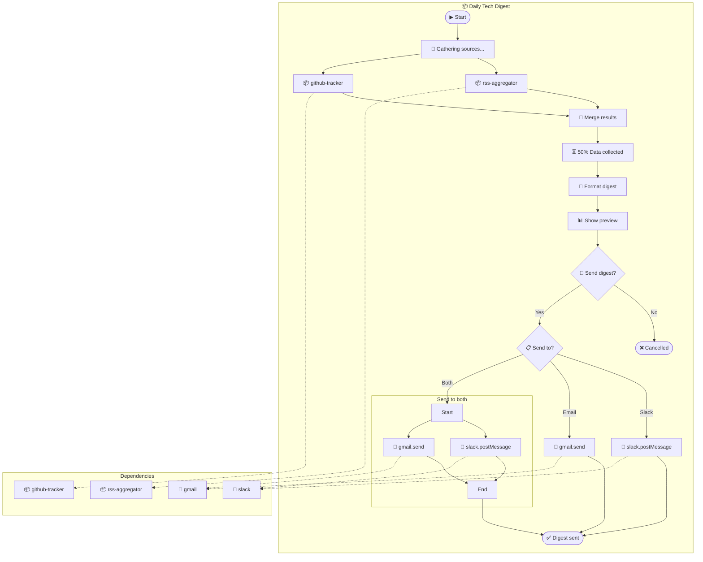
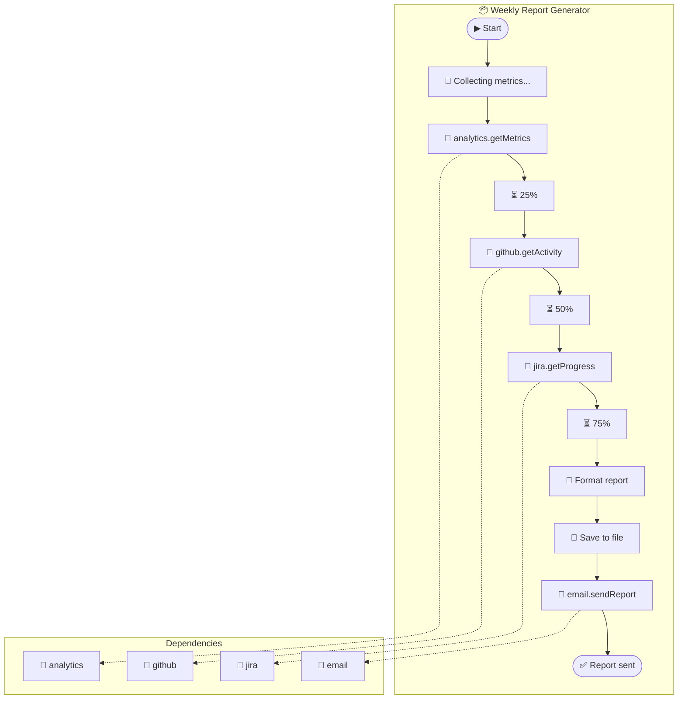

```mermaid
flowchart TD
    subgraph web-scraper["📦 Web Scraping Pipeline"]
        START([▶ Start])
        START --> CONFIG{✏️ Enter target URL}
        CONFIG --> STATUS1[📢 Analyzing page...]
        STATUS1 --> THINK1[🧠 Thinking...]

        THINK1 --> DISCOVER[🌐 Discover items]
        DISCOVER --> PROGRESS1[⏳ 20% Found N items]

        PROGRESS1 --> CONFIRM1{🙋 Proceed with scraping?}
        CONFIRM1 -->|No| CANCELLED([❌ Cancelled])
        CONFIRM1 -->|Yes| SCRAPE

        SCRAPE[🔄 Scrape items] --> PROGRESS2[⏳ 60%]

        PROGRESS2 --> ERRORS{Errors occurred?}
        ERRORS -->|Yes| SHOW_ERRORS[⚠️ Show errors]
        SHOW_ERRORS --> CONFIRM2{🙋 Continue anyway?}
        CONFIRM2 -->|No| CANCELLED
        CONFIRM2 -->|Yes| REVIEW
        ERRORS -->|No| REVIEW

        REVIEW[📊 Show sample data]
        REVIEW --> CONFIRM3{🙋 Data quality OK?}
        CONFIRM3 -->|No| CANCELLED
        CONFIRM3 -->|Yes| FORMAT

        FORMAT{📋 Output format?}
        FORMAT -->|JSON| SAVE_JSON[💾 Save JSON]
        FORMAT -->|CSV| SAVE_CSV[💾 Save CSV]
        FORMAT -->|Both| SAVE_BOTH[💾 Save both]

        SAVE_JSON --> TOAST[🎉 Saved!]
        SAVE_CSV --> TOAST
        SAVE_BOTH --> TOAST

        TOAST --> SUCCESS([✅ Success])
    end
```

# Photon Visualizer Examples

Complete examples of Photon↔Mermaid conversions for real-world workflows.

---

## Example 1: Daily Tech Digest

### Use Case
Aggregate news from multiple sources, summarize, and send to Slack/email.

### Mermaid Diagram



### Photon Code

```typescript
/**
 * Daily Tech Digest
 *
 * Aggregates news from RSS feeds and GitHub releases,
 * formats a digest, and sends to Slack/email.
 *
 * @name daily-digest
 * @description Daily tech news and release digest
 * @dependencies date-fns@^2.30.0
 * @mcps slack, gmail
 * @photons rss-aggregator, github-tracker
 */

export default class DailyDigest {
  async *run(params: {
    feeds: string[];
    repos: string[];
    recipients?: string[];
    slackChannel?: string;
  }) {
    yield { emit: 'status', message: 'Gathering sources...' };

    // Collect data from multiple Photons
    const [rssResult, githubResult] = await Promise.all([
      this.runPhoton('rss-aggregator', {
        feeds: params.feeds,
        maxPerFeed: 5
      }),
      this.runPhoton('github-tracker', {
        repos: params.repos
      })
    ]);

    yield { emit: 'progress', value: 0.5, message: 'Data collected' };

    // Format the digest
    const digest = this.formatDigest(rssResult, githubResult);

    // Show preview
    yield {
      emit: 'artifact',
      type: 'document',
      title: 'Digest Preview',
      content: digest
    };

    // Confirm before sending
    const send: boolean = yield {
      ask: 'confirm',
      message: 'Send this digest?'
    };

    if (!send) {
      return { cancelled: true };
    }

    // Choose destination
    const destination: string = yield {
      ask: 'select',
      message: 'Send digest to:',
      options: [
        { value: 'slack', label: 'Slack only' },
        { value: 'email', label: 'Email only' },
        { value: 'both', label: 'Both Slack and Email' }
      ]
    };

    // Send based on selection
    if (destination === 'slack' || destination === 'both') {
      await this.mcp('slack').postMessage({
        channel: params.slackChannel || '#daily-digest',
        text: digest
      });
    }

    if (destination === 'email' || destination === 'both') {
      await this.mcp('gmail').send({
        to: params.recipients || [],
        subject: `Tech Digest - ${new Date().toLocaleDateString()}`,
        body: digest
      });
    }

    yield { emit: 'toast', message: 'Digest sent!', type: 'success' };

    return {
      success: true,
      feedCount: rssResult.entriesCollected,
      releaseCount: githubResult.newReleases.length
    };
  }

  private formatDigest(rss: any, github: any): string {
    // ... formatting logic
  }

  private async runPhoton(name: string, params: any): Promise<any> {
    const photon = await this.photon(name);
    const generator = photon.run(params);
    // Execute generator to completion
    let result = await generator.next();
    while (!result.done) {
      yield result.value; // Forward yields
      result = await generator.next();
    }
    return result.value;
  }
}
```

---

## Example 2: Web Scraping Pipeline

### Use Case
Scrape websites, validate data quality with human review, and save in chosen format.

### Mermaid Diagram



### Photon Code

```typescript
/**
 * Web Scraping Pipeline
 *
 * Multi-step web scraper with human-in-the-loop quality review.
 *
 * @name web-scraper
 * @description Scrape websites with quality review
 * @dependencies cheerio@^1.0.0, csv-stringify@^6.4.0
 */

export default class WebScraper {
  async *run(params: { defaultUrl?: string }) {
    // Get target URL
    const url: string = yield {
      ask: 'text',
      id: 'target_url',
      message: 'Enter target URL:',
      default: params.defaultUrl || '',
      pattern: '^https?://.+'
    };

    yield { emit: 'status', message: 'Analyzing page...' };
    yield { emit: 'thinking', active: true };

    // Discover items
    const items = await this.discoverItems(url);

    yield { emit: 'thinking', active: false };
    yield { emit: 'progress', value: 0.2, message: `Found ${items.length} items` };

    // Confirm before scraping
    const proceed: boolean = yield {
      ask: 'confirm',
      message: `Found ${items.length} items. Proceed with scraping?`
    };

    if (!proceed) return { cancelled: true };

    // Scrape items
    const { scraped, errors } = await this.scrapeItems(items, (progress) => {
      // This would need a callback mechanism in practice
    });

    yield { emit: 'progress', value: 0.6 };

    // Handle errors
    if (errors.length > 0) {
      yield { emit: 'toast', message: `${errors.length} errors occurred`, type: 'warning' };

      const continueAnyway: boolean = yield {
        ask: 'confirm',
        message: `${errors.length} items failed. Continue with ${scraped.length} successful?`
      };

      if (!continueAnyway) return { cancelled: true, errors };
    }

    // Quality review
    yield {
      emit: 'artifact',
      type: 'json',
      title: 'Sample Data',
      content: JSON.stringify(scraped.slice(0, 3), null, 2)
    };

    const qualityOk: boolean = yield {
      ask: 'confirm',
      message: 'Data quality looks good?'
    };

    if (!qualityOk) return { cancelled: true, reason: 'quality_rejected' };

    // Choose format
    const format: string = yield {
      ask: 'select',
      id: 'output_format',
      message: 'Output format:',
      options: ['JSON', 'CSV', 'Both']
    };

    // Save
    const outputPath = await this.saveOutput(scraped, format.toLowerCase());

    yield { emit: 'toast', message: 'Saved!', type: 'success' };

    return {
      success: true,
      itemCount: scraped.length,
      errorCount: errors.length,
      outputPath
    };
  }
}
```

---

## Example 3: GitHub Issue Triage

### Use Case
Fetch open issues, categorize with AI, and assign labels/assignees.

### Mermaid Diagram

```mermaid
flowchart TD
    subgraph issue-triage["📦 GitHub Issue Triage"]
        START([▶ Start])

        START --> REPO{✏️ Enter repo (owner/name)}
        REPO --> STATUS1[📢 Fetching issues...]
        STATUS1 --> FETCH[🔌 github.listIssues]

        FETCH --> COUNT{Issues found?}
        COUNT -->|None| EMPTY([✅ No issues to triage])
        COUNT -->|Yes| PROGRESS1[⏳ 25%]

        PROGRESS1 --> THINK[🧠 AI categorizing...]
        THINK --> CATEGORIZE[🤖 Analyze with AI]
        CATEGORIZE --> PROGRESS2[⏳ 50%]

        PROGRESS2 --> PREVIEW[📊 Show categorization]
        PREVIEW --> CONFIRM{🙋 Apply labels?}
        CONFIRM -->|No| SKIP_LABELS
        CONFIRM -->|Yes| APPLY_LABELS

        APPLY_LABELS[🔌 github.addLabels] --> PROGRESS3[⏳ 75%]
        SKIP_LABELS --> ASSIGN_Q

        PROGRESS3 --> ASSIGN_Q{🙋 Auto-assign?}
        ASSIGN_Q -->|No| SUCCESS
        ASSIGN_Q -->|Yes| ASSIGN

        ASSIGN[🔌 github.assignIssue] --> SUCCESS
        SUCCESS([✅ Triage complete])
    end

    subgraph deps["Dependencies"]
        DEP_GH[🔌 github]
        DEP_AI[🤖 claude]
    end

    FETCH -.-> DEP_GH
    APPLY_LABELS -.-> DEP_GH
    ASSIGN -.-> DEP_GH
    CATEGORIZE -.-> DEP_AI
```

### Photon Code

```typescript
/**
 * GitHub Issue Triage
 *
 * Automatically categorize and label GitHub issues using AI.
 *
 * @name issue-triage
 * @description AI-powered GitHub issue triage
 * @mcps github, claude
 */

export default class IssueTriage {
  async *run(params: { repo?: string }) {
    // Get repo
    const repo: string = yield {
      ask: 'text',
      id: 'repo',
      message: 'Enter repository (owner/name):',
      default: params.repo || '',
      pattern: '^[\\w-]+/[\\w-]+$'
    };

    yield { emit: 'status', message: 'Fetching issues...' };

    // Fetch open issues
    const github = await this.mcp('github');
    const issues = await github.listIssues({
      repo,
      state: 'open',
      labels: 'needs-triage'
    });

    if (issues.length === 0) {
      yield { emit: 'toast', message: 'No issues to triage', type: 'info' };
      return { success: true, triaged: 0 };
    }

    yield { emit: 'progress', value: 0.25 };
    yield { emit: 'thinking', active: true };

    // AI categorization
    const claude = await this.mcp('claude');
    const categorized = await claude.analyze({
      prompt: `Categorize these GitHub issues:
${issues.map(i => `#${i.number}: ${i.title}`).join('\n')}

For each, suggest:
- Labels (bug, feature, docs, etc.)
- Priority (high, medium, low)
- Suggested assignee based on expertise`,
      format: 'json'
    });

    yield { emit: 'thinking', active: false };
    yield { emit: 'progress', value: 0.5 };

    // Show preview
    yield {
      emit: 'artifact',
      type: 'json',
      title: 'Categorization',
      content: JSON.stringify(categorized, null, 2)
    };

    // Apply labels?
    const applyLabels: boolean = yield {
      ask: 'confirm',
      message: `Apply suggested labels to ${issues.length} issues?`
    };

    if (applyLabels) {
      for (const issue of categorized) {
        await github.addLabels({
          repo,
          issue: issue.number,
          labels: issue.suggestedLabels
        });
      }

      yield { emit: 'progress', value: 0.75 };
    }

    // Auto-assign?
    const autoAssign: boolean = yield {
      ask: 'confirm',
      message: 'Auto-assign issues to suggested owners?'
    };

    if (autoAssign) {
      for (const issue of categorized) {
        if (issue.suggestedAssignee) {
          await github.assignIssue({
            repo,
            issue: issue.number,
            assignee: issue.suggestedAssignee
          });
        }
      }
    }

    yield { emit: 'toast', message: 'Triage complete!', type: 'success' };

    return {
      success: true,
      triaged: issues.length,
      labelsApplied: applyLabels,
      assigned: autoAssign
    };
  }
}
```

---

## Example 4: Scheduled Report Generator

### Use Case
Generate weekly reports from multiple data sources, suitable for cron scheduling.

### Mermaid Diagram



### Photon Code (Automation Mode)

```typescript
/**
 * Weekly Report Generator
 *
 * Generates and sends weekly reports. Designed for scheduled execution
 * with no interactive prompts.
 *
 * @name weekly-report
 * @description Automated weekly report generation
 * @mcps analytics, github, jira, email
 */

export default class WeeklyReport {
  /**
   * Automated run for scheduling (no prompts)
   */
  async *autoRun(params: {
    repos: string[];
    jiraProject: string;
    recipients: string[];
  }) {
    yield { emit: 'status', message: 'Collecting metrics...' };

    // Collect from analytics
    const analytics = await this.mcp('analytics');
    const metrics = await analytics.getMetrics({
      period: 'last_7_days'
    });

    yield { emit: 'progress', value: 0.25 };

    // Collect from GitHub
    const github = await this.mcp('github');
    const activity = await github.getActivity({
      repos: params.repos,
      since: this.getLastWeek()
    });

    yield { emit: 'progress', value: 0.5 };

    // Collect from Jira
    const jira = await this.mcp('jira');
    const progress = await jira.getProgress({
      project: params.jiraProject
    });

    yield { emit: 'progress', value: 0.75 };

    // Format report
    const report = this.formatReport(metrics, activity, progress);

    // Save to file
    const fs = await import('fs/promises');
    const filename = `weekly-report-${new Date().toISOString().split('T')[0]}.md`;
    await fs.writeFile(filename, report);

    yield { emit: 'log', message: `Saved: ${filename}`, level: 'info' };

    // Send via email
    const email = await this.mcp('email');
    await email.sendReport({
      to: params.recipients,
      subject: `Weekly Report - ${new Date().toLocaleDateString()}`,
      body: report,
      attachments: [{ path: filename }]
    });

    yield { emit: 'toast', message: 'Report sent!', type: 'success' };

    return {
      success: true,
      filename,
      recipients: params.recipients.length
    };
  }

  /**
   * Interactive run with previews and confirmations
   */
  async *run(params: {
    repos: string[];
    jiraProject: string;
    recipients: string[];
  }) {
    // ... same collection logic ...

    // Show preview
    yield {
      emit: 'artifact',
      type: 'document',
      title: 'Report Preview',
      content: report
    };

    // Confirm before sending
    const send: boolean = yield {
      ask: 'confirm',
      message: `Send to ${params.recipients.length} recipients?`
    };

    if (!send) return { cancelled: true };

    // ... send logic ...
  }

  private formatReport(metrics: any, activity: any, progress: any): string {
    return `# Weekly Report

## Metrics
- Page Views: ${metrics.pageViews}
- Users: ${metrics.users}

## GitHub Activity
- Commits: ${activity.commits}
- PRs Merged: ${activity.prsMerged}

## Jira Progress
- Completed: ${progress.completed}
- In Progress: ${progress.inProgress}
`;
  }

  private getLastWeek(): string {
    const d = new Date();
    d.setDate(d.getDate() - 7);
    return d.toISOString();
  }
}
```

---

## Conversion Tips

### From Mermaid to Photon

1. **Start with subgraph title** → Class name and JSDoc `@name`
2. **Dependencies subgraph** → JSDoc `@mcps` and `@photons`
3. **Stadium nodes** → Entry/return points
4. **Rectangle nodes** → Sequential statements
5. **Diamond nodes** → `yield { ask }` + conditionals
6. **Dotted arrows** → Dependency declarations
7. **Arrow labels** → Conditional branches (`if/else` or `switch`)

### From Photon to Mermaid

1. **Class JSDoc** → Subgraph title and deps section
2. **`yield { emit: 'status' }`** → Rectangle node with 📢
3. **`yield { emit: 'progress' }`** → Rectangle node with ⏳ + percentage
4. **`yield { ask: 'confirm' }`** → Diamond with 🙋 and Yes/No branches
5. **`yield { ask: 'select' }`** → Diamond with 📋 and option branches
6. **`yield { ask: 'text' }`** → Diamond with ✏️
7. **`await this.mcp(...)`** → Rectangle with 🔌 or specific emoji
8. **`yield* this.photon(...)`** → Rectangle with 📦
9. **`return { cancelled }`** → Stadium with ❌
10. **`return { success }`** → Stadium with ✅
