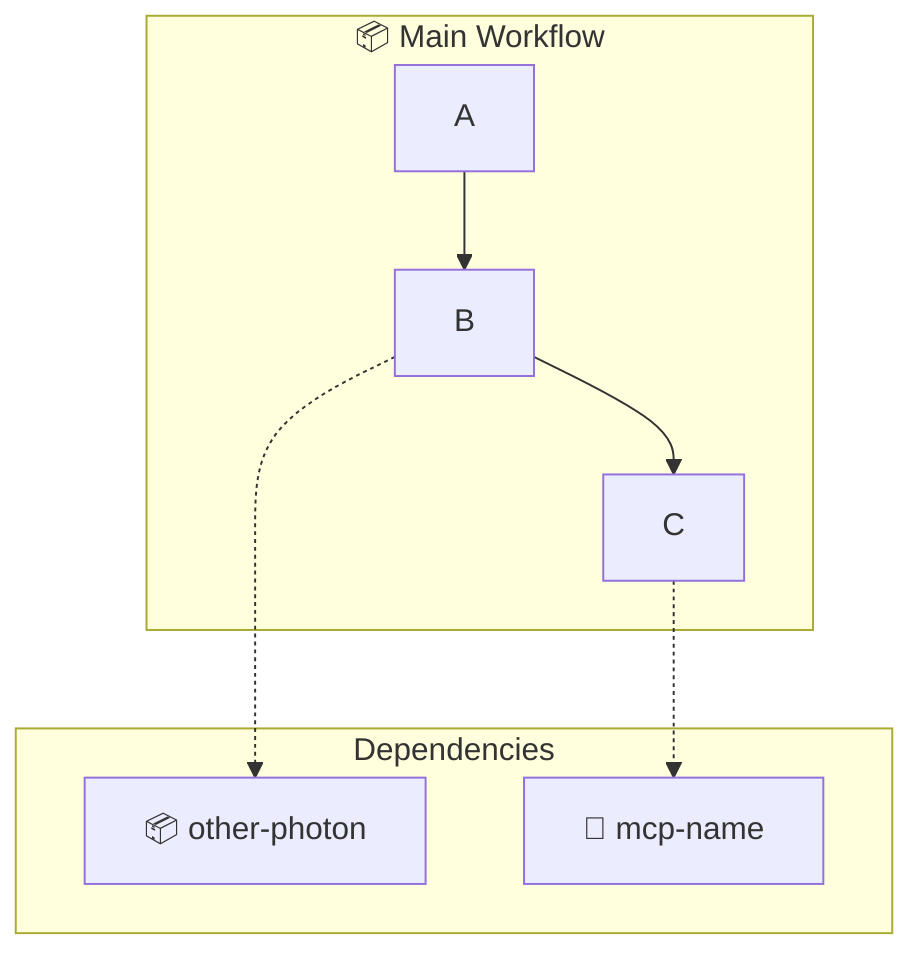
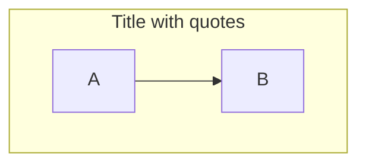
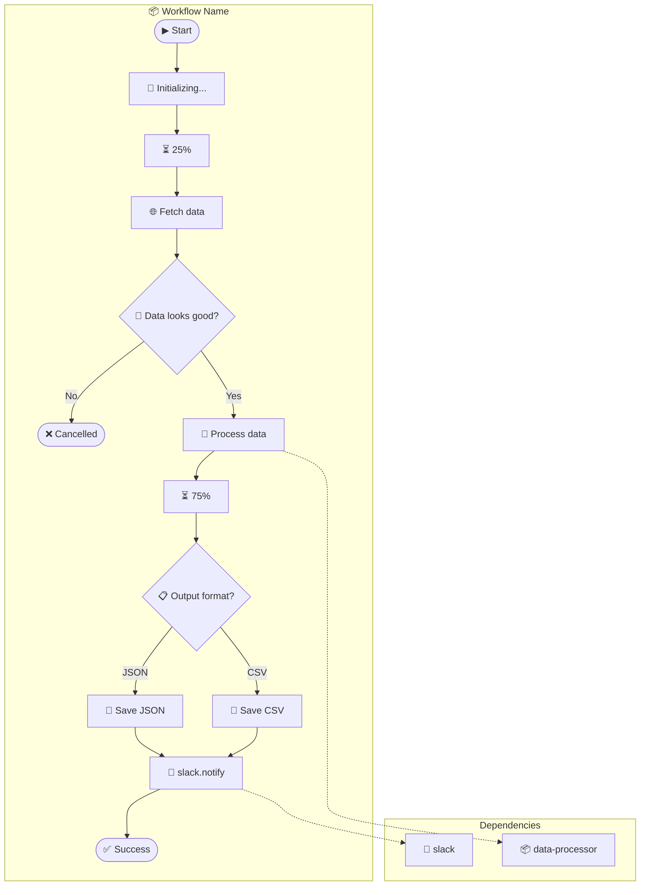
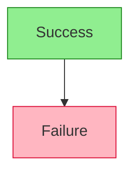
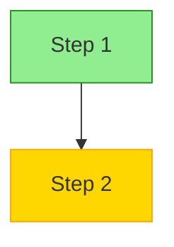
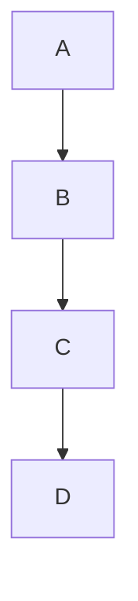
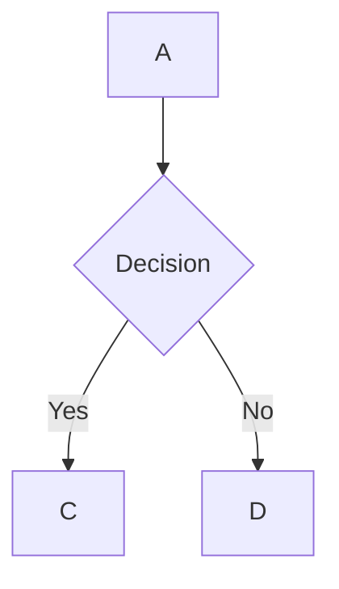
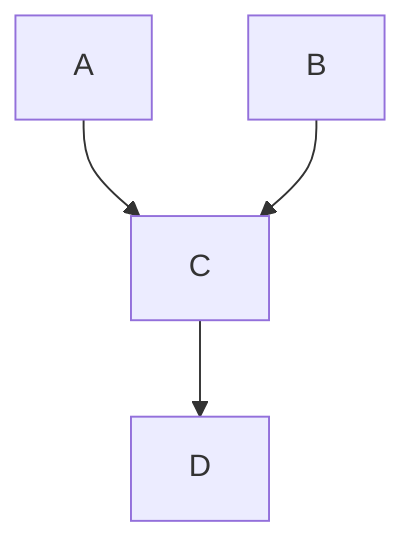
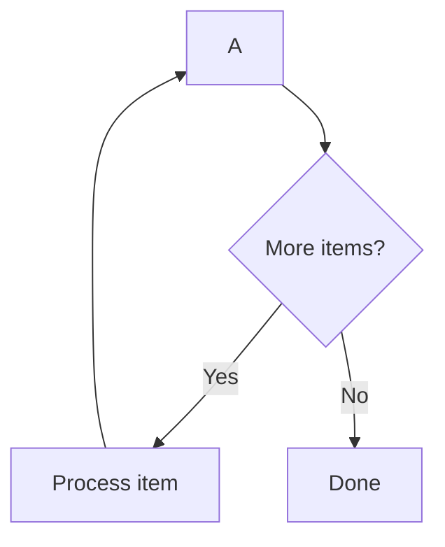

# Mermaid Flowchart Syntax Reference

## Basic Syntax

### Flowchart Direction

```mermaid
flowchart TD    %% Top-Down (default for workflows)
flowchart LR    %% Left-Right
flowchart BT    %% Bottom-Top
flowchart RL    %% Right-Left
```

**Recommendation**: Use `TD` (Top-Down) for workflows as it matches natural reading order.

---

## Node Shapes

### For Photon Workflows

| Shape | Syntax | Use Case |
|-------|--------|----------|
| Stadium | `([text])` | Start/End points |
| Rectangle | `[text]` | Actions, emits |
| Diamond | `{text}` | Decisions, asks |
| Rounded | `(text)` | Sub-processes |
| Hexagon | `{{text}}` | Preparation steps |

### Examples

```mermaid
flowchart TD
    A([Start])           %% Stadium - entry/exit
    B[Process data]      %% Rectangle - action
    C{Make decision}     %% Diamond - decision
    D(Sub-process)       %% Rounded - helper
    E{{Prepare}}         %% Hexagon - setup
```

---

## Arrows and Connections

### Basic Arrows

```mermaid
flowchart TD
    A --> B        %% Standard arrow
    A --- B        %% Line without arrow
    A -.-> B       %% Dotted arrow (for dependencies)
    A ==> B        %% Thick arrow (for emphasis)
    A --text--> B  %% Arrow with label
    A -->|text| B  %% Arrow with label (alternative)
```

### For Photon Workflows

| Arrow Type | Meaning |
|------------|---------|
| `-->` | Normal flow |
| `-.->` | Dependency reference |
| `-->│Yes│` | Conditional true branch |
| `-->│No│` | Conditional false branch |

---

## Subgraphs

### Grouping Related Nodes



### Styling Subgraphs



---

## Node IDs and Labels

### Naming Convention for Photon Workflows

```mermaid
flowchart TD
    START([▶ Start])           %% Entry point
    STATUS1[📢 Connecting...]   %% Status emit
    PROGRESS1[⏳ 50%]           %% Progress emit
    CONFIRM1{🙋 Continue?}      %% Confirm ask
    SELECT1{📋 Choose format}   %% Select ask
    TEXT1{✏️ Enter name}        %% Text ask
    MCP_GMAIL[📧 gmail.send]    %% MCP call
    PHOTON_RSS[📦 rss-agg]      %% Photon call
    SUCCESS([✅ Success])       %% Success endpoint
    CANCELLED([❌ Cancelled])   %% Failure endpoint
```

---

## Emoji Conventions for Photon

### Emit Types

| Emoji | Emit Type | Example |
|-------|-----------|---------|
| 📢 | status | `[📢 Processing...]` |
| ⏳ | progress | `[⏳ 75% Almost done]` |
| 📝 | log | `[📝 Debug info]` |
| 🎉 | toast (success) | `[🎉 Completed!]` |
| ⚠️ | toast (warning) | `[⚠️ Rate limited]` |

### Ask Types

| Emoji | Ask Type | Example |
|-------|----------|---------|
| 🙋 | confirm | `{🙋 Proceed?}` |
| 📋 | select | `{📋 Choose option}` |
| ✏️ | text | `{✏️ Enter value}` |
| 🔢 | number | `{🔢 Enter count}` |
| 📅 | date | `{📅 Select date}` |
| 🔒 | password | `{🔒 Enter API key}` |

### External Calls

| Emoji | Type | Example |
|-------|------|---------|
| 📦 | Photon | `[📦 rss-aggregator]` |
| 🔌 | MCP | `[🔌 gmail]` |
| 📧 | Email MCP | `[📧 gmail.send]` |
| 💬 | Chat MCP | `[💬 slack.post]` |
| 🌐 | HTTP | `[🌐 fetch]` |
| 💾 | Storage | `[💾 filesystem.write]` |

### Endpoints

| Emoji | Meaning | Example |
|-------|---------|---------|
| ▶ | Start | `([▶ Start])` |
| ✅ | Success | `([✅ Success])` |
| ❌ | Cancelled/Failed | `([❌ Cancelled])` |
| ⏹ | End (neutral) | `([⏹ End])` |

---

## Complete Workflow Template



---

## Styling (Optional)

### Custom Styles



### Class Definitions



---

## Common Patterns

### Linear Flow



### Branching



### Merging



### Loop (Conceptual)



---

## Rendering

Mermaid diagrams render automatically in:
- **GitHub** - README.md, PRs, Issues
- **VSCode** - With Mermaid extension
- **Notion** - Code blocks with mermaid language
- **Obsidian** - Native support
- **GitLab** - Native support
- **Confluence** - With plugin

For standalone rendering:
- [Mermaid Live Editor](https://mermaid.live/)
- `npx @mermaid-js/mermaid-cli` for CLI rendering
